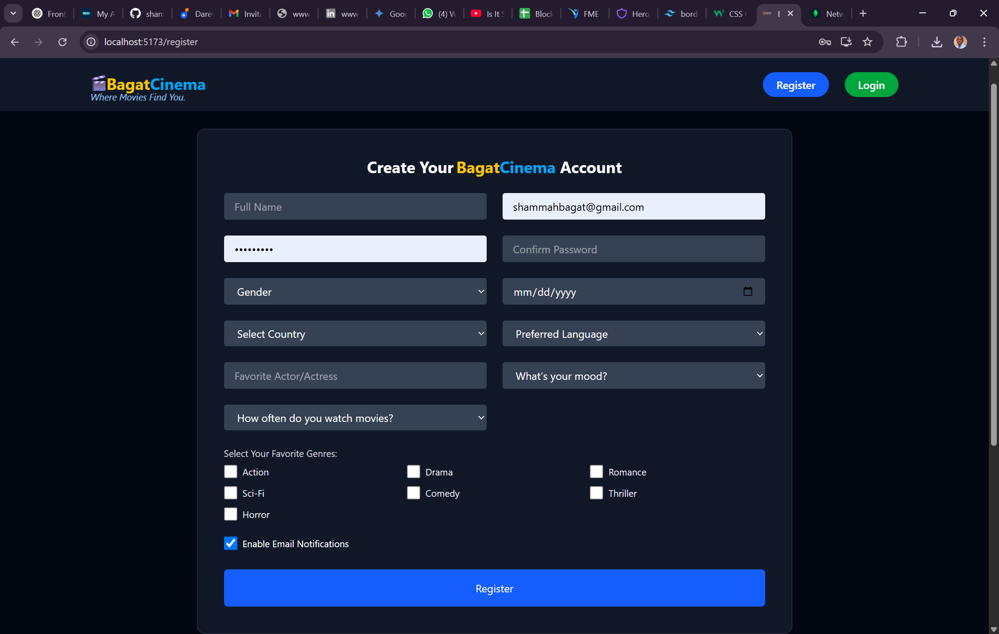
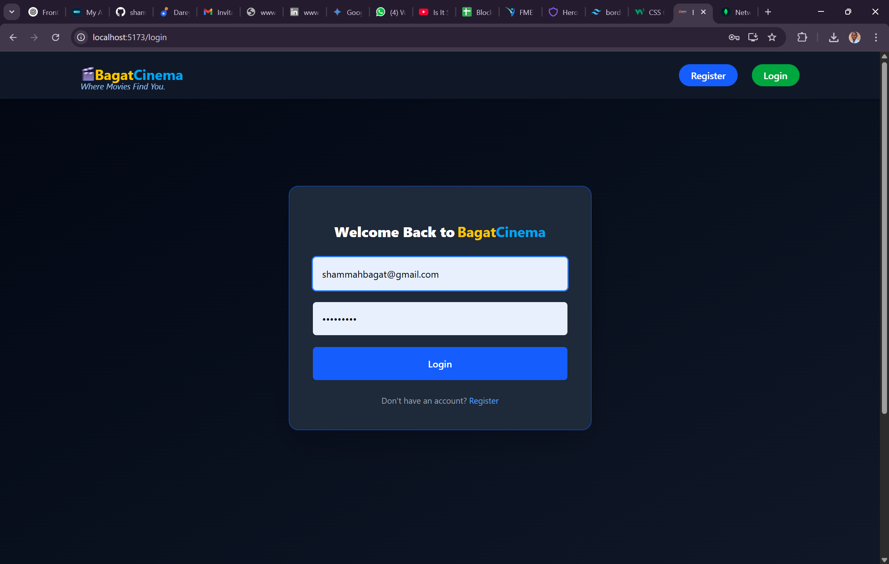
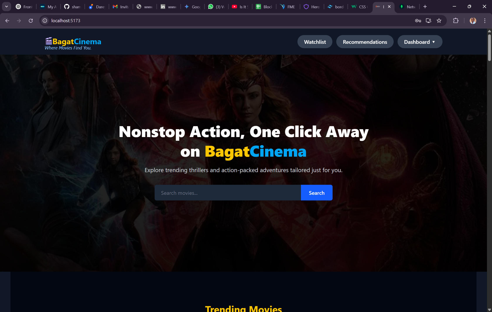
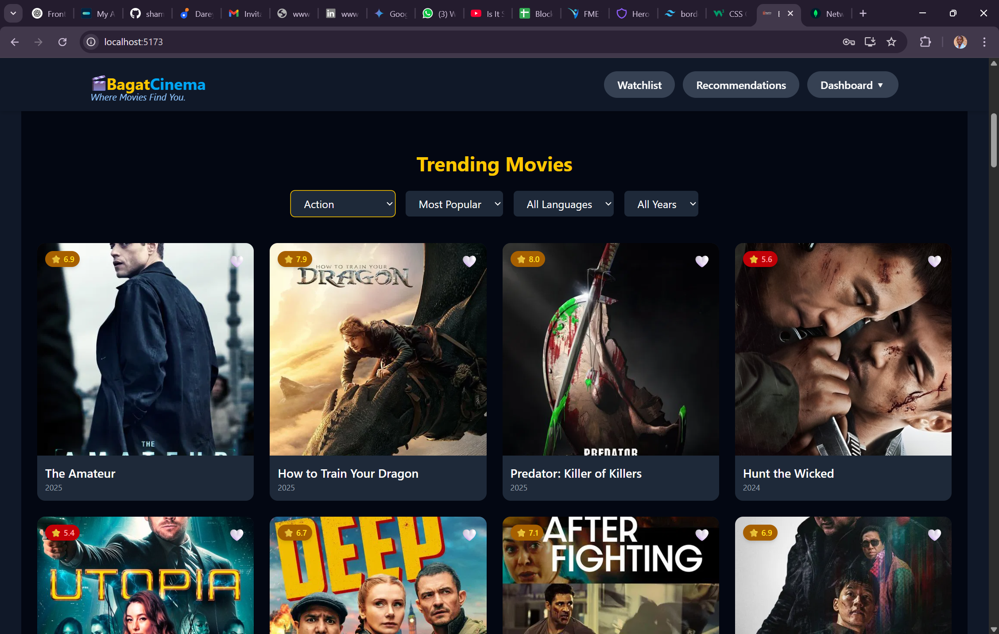
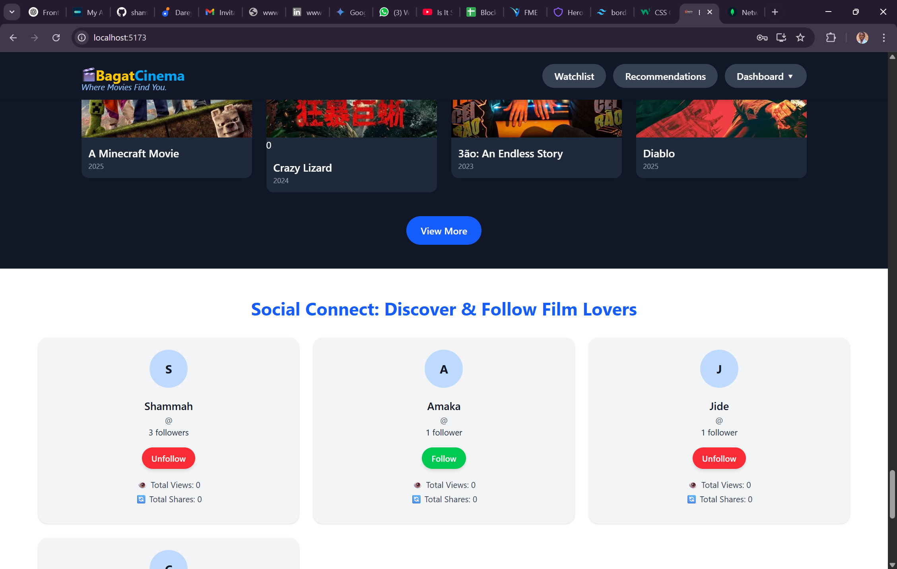
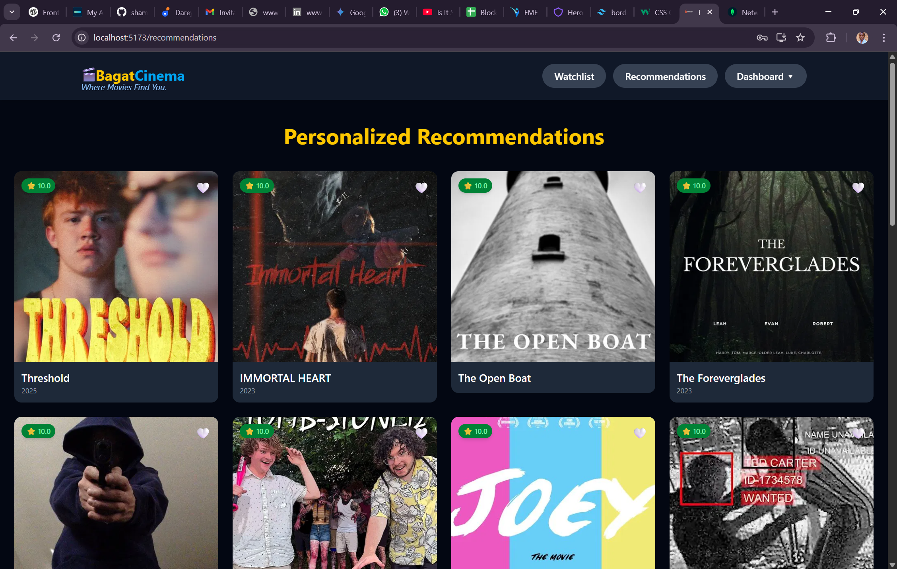
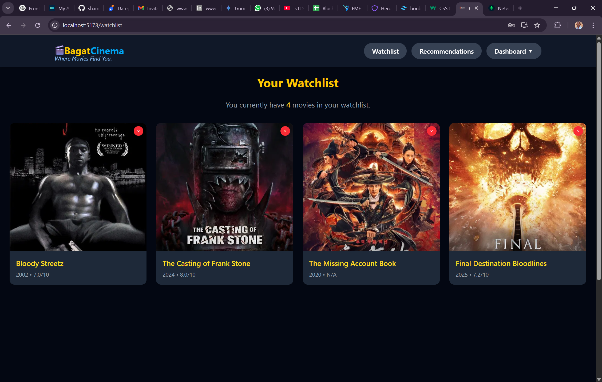
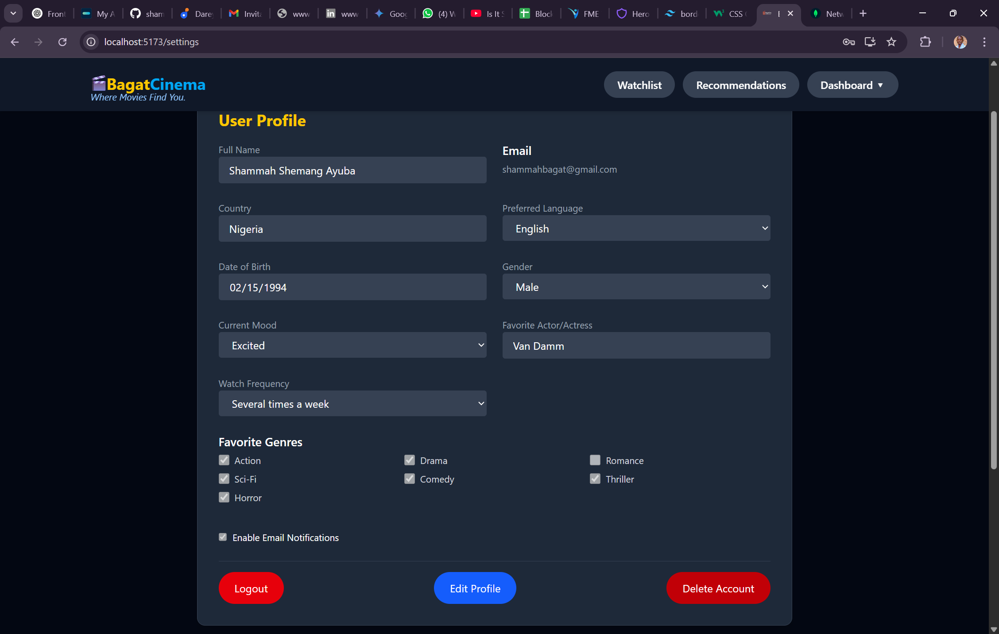
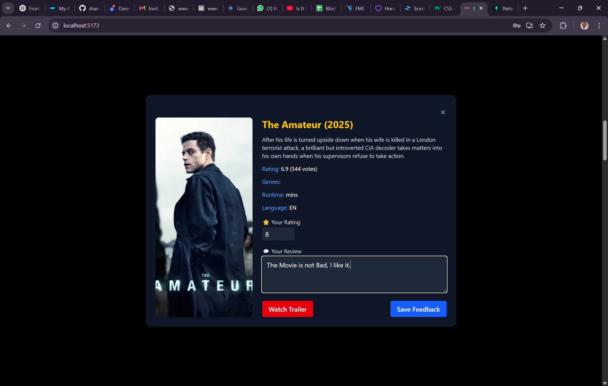

# BagatCinema

BagatCinema is a fullstack movie recommendation web app with user accounts, social connections, personalized recommendations, and watchlist functionality. Built with **React.js (Vite)** for the frontend and **Express.js + MongoDB Atlas** for the backend. It integrates with the [TMDB API](https://www.themoviedb.org/documentation/api) for real-time movie data.

## Project Overview

This project showcases full CRUD operations on movie and user data with a cleanly modular structure. It demonstrates real-world fullstack skills, including:

- API development & integration
- JWT-based authentication
- Dynamic frontend UX with caching & filters
- Social features and feedback-driven recommendations

## Prerequisites

- Node.js (v16+ recommended)
- npm (Node Package Manager)
- MongoDB Atlas (or local MongoDB)
- TMDB API key
- Code editor (VS Code recommended)
- Thunder Client / Postman (for API testing)

## Installation & Setup

### 1. Clone the repository

- git clone https://github.com/your-username/bagatcinema.git
- cd bagatcinema

### 2. Backend Setup (`/backend`)

- cd backend
- npm install

Create .env with:

- PORT=5000
- MONGO_URI=your_mongo_db_uri
- JWT_SECRET=your_secret_key
- TMDB_API_KEY=your_tmdb_api_key

Run backend server:

- npm run server

### 3. Frontend Setup (`/frontend`)

- cd ../frontend
- npm install

Create .env with:

- VITE_BACKEND_URL=http://localhost:5000/api
- VITE_TMDB_API_KEY=the_tmdb_api_key

Run frontend:

- npm run dev

### 4. Run Both with Concurrency (optional)

From root:

- npm run dev

> Requires `concurrently` in package.json

## Technologies Used

- **React.js + Vite**
- **Tailwind CSS**
- **Express.js**
- **MongoDB Atlas + Mongoose**
- **JWT Authentication**
- **TMDB API**
- **Axios + LocalStorage**
- **Thunder Client** (for testing)

## Authentication Flow

- Users register and login
- JWT is stored in `localStorage` as `bagatcinemaUserInfo`
- Authenticated requests include `Authorization: Bearer <token>`
- Protected routes handled with middleware (`authMiddleware.js`)

## Project Structure

bagatcinema/
- frontend/ # React frontend
  - icons
  - node_modules
  - public
  - src
  - .env
  - .gitignore
  - eslint.config.js
  - index.html
  - manifest.json
  - offline.html
  - package-lock.json
  - package.json
  - README.md
  - .service-worker.js
  - vite.config.js
  - yarn.lock

- backend/ # Express.js API
  - controllers
  - middleware
  - models
  - node_modules
  - routes
  - scripts
  - .env
  - .env.example
  - .gitignore
  - package-lock.json
  - README.md
  - server.js
  - package.json

- assets/ # Screenshots and images
  - HomePage.png
  - FeaturedMovies.png
  - MovieTrailer.png
  - Watchlist.png
  - RecommendationPage.png
  - SocialConnect.png
  - RegisteringPage.png
  - LoginPage.png
  - UserProfile.png
  - README.md # Main overview

## Key Features

- User registration, login, profile editing
- Add/remove movies from personal watchlist
- Rate and review movies (feedback system)
- Follow/unfollow other users
- Personalized recommendations powered by:
- Genres, moods, preferred languages
- Favorite actor
- Watch frequency
- Feedback and watchlist history
  - TMDB integration for real-time movie data
  - Movie search, filter by genre, year, language
  - Full JWT auth system
- Progressive Web Application (PWA)

## API Endpoint Examples

- All API routes are prefixed with `/api`.

### Auth & Users

- `POST /api/auth/register`
- `POST /api/auth/login`
- `GET /api/auth/me`
- `PUT /api/user/profile`
- `DELETE /api/user/delete`

### Watchlist

- `GET /api/watchlist`
- `POST /api/watchlist`
- `DELETE /api/watchlist/:movieId`

### Feedback

- `GET /api/feedback`
- `POST /api/feedback`
- `DELETE /api/feedback/:movieId`

### Recommendations

- `GET /api/recommendations`

### Social

- `POST /api/social/follow/:userId`
- `DELETE /api/social/unfollow/:userId`
- `GET /api/social/followers`
- `GET /api/social/following`

## Error Handling

- `400 Bad Request` – Input validation failure
- `401 Unauthorized` – Missing/invalid token
- `404 Not Found` – Resource doesn't exist
- `500 Internal Server Error` – Unhandled errors

## Visual Proof

### Registration Page

### Login Page

### Home Page

### FeaturedMovies Page

### Social Connects Page

### Recommendation Page

### Watchlist Page

### User Profile Page

### Movie Trailer Card Page

## Notes

- Movies are only saved if they include a valid `poster_path`
- TMDB requests are cached to reduce API calls
- Feedback and watchlist are used for personalized suggestions
- Social features enhance community interaction

## Author

**Shammah Shemang Ayuba**  
[GitHub](https://github.com/shammah124)

## License

MIT License © 2025 Shammah Ayuba
